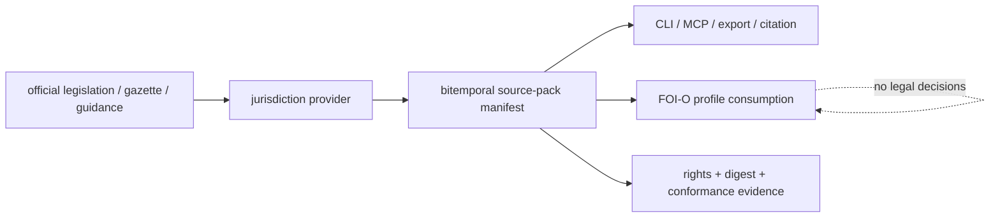

# Design

```mermaid
flowchart LR
  SOURCES["official legislation / gazette / guidance"] --> PROVIDER["jurisdiction provider"]
  PROVIDER --> PACK["bitemporal source-pack manifest"]
  PACK --> API["CLI / MCP / export / citation"]
  PACK --> FOIO["FOI-O profile consumption"]
  PACK --> EVID["rights + digest + conformance evidence"]
  FOIO -.no legal decisions.-> FOIO
```
